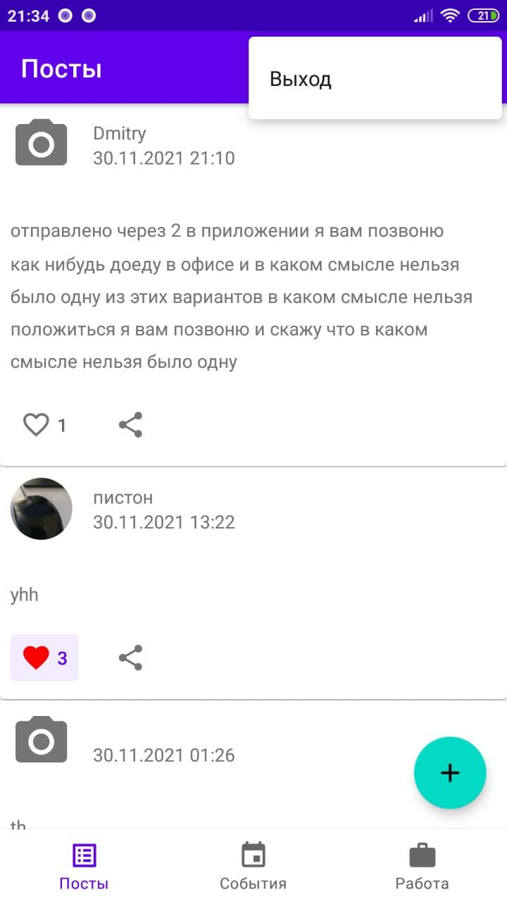

# Дипломное задание "NeWork" (Профессия Android Developer)

Вход в социальную сеть осуществляется в меню Экшен Бара (три точки). Кнопка "Выход" также находится в этом меню

Логин и аватар (или заглушка) текущего пользователя отображается в Экшен Баре

Навигация по приложению осуществляется с помощью Боттом Навигейшн бара. 

Добавление новых элементов выполняется в помощью зелёных кнопок со знаком "+".

Если кликнуть на вложенное изображение, откроется фрагмент для полноэкранного просмотра.

Удаление/Редактирование элементов находятся в меню (три точки) справа от элемента.

Если вход не выплнен и пользователь попробует выполнить действие требующие авторизации, появится диалоговое окно с предложением войти/зарегистрироваться.

Ниже приведены скриншоты:

     

    